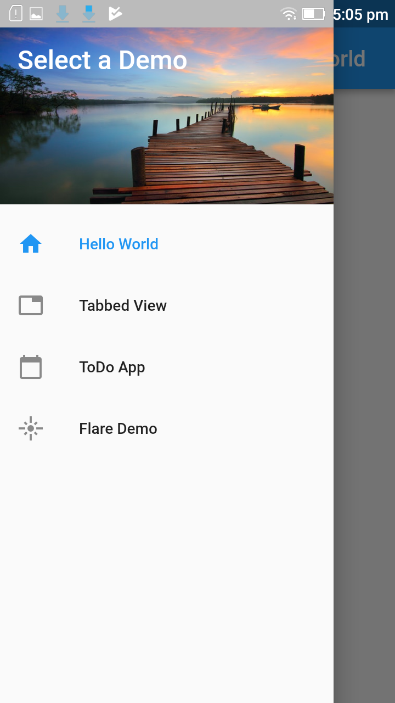
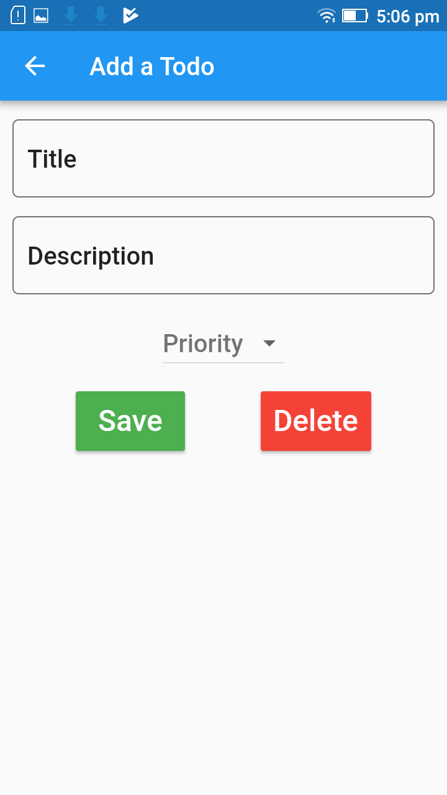
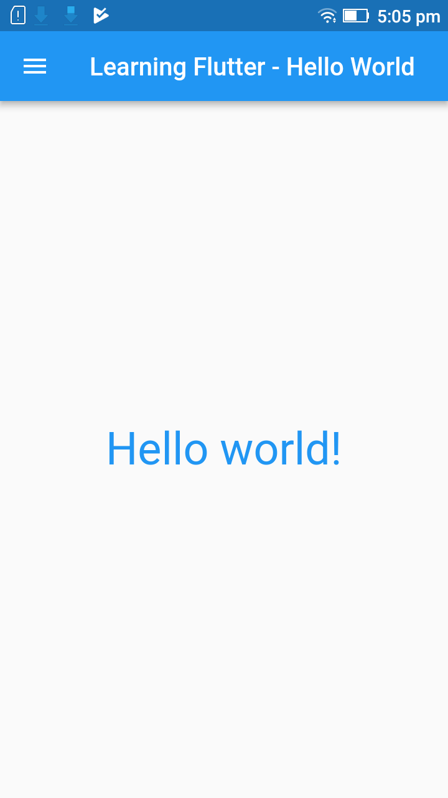
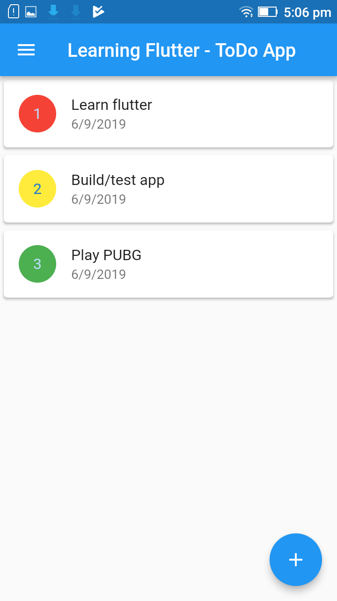

# flutter-app-1

My first Flutter application for learning purpose.

## Flutter: Getting Started

For help getting started with Flutter, view our online
[documentation](https://flutter.io/).

## User guide

### Views
a. Home
b. Tabbed

### 3rd party widgets
- iOS like settings - [flutter_cupertino_settings](https://github.com/matthinc/flutter_cupertino_settings)

## Screenshots

